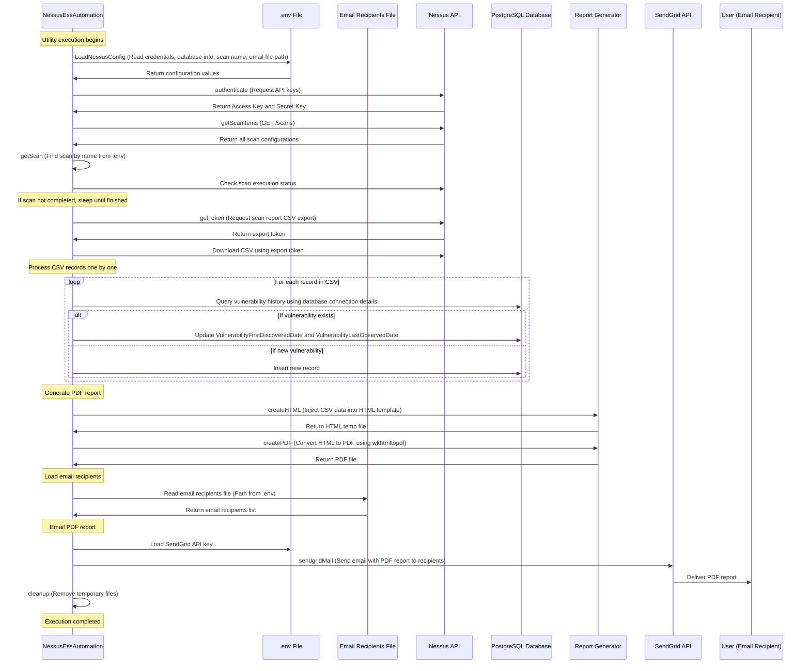

```mermaid
sequenceDiagram
    participant Utility as NessusEssAutomation
    participant .env as .env File
    participant EmailFile as Email Recipients File
    participant Nessus_API as Nessus API
    participant PostgreSQL as PostgreSQL Database
    participant Report as Report Generator
    participant Sendgrid as SendGrid API
    participant User as User (Email Recipient)

    Note over Utility: Utility execution begins
    Utility->>.env: LoadNessusConfig (Read credentials, database info, scan name, email file path)
    .env->>Utility: Return configuration values
    
    Utility->>Nessus_API: authenticate (Request API keys)
    Nessus_API->>Utility: Return Access Key and Secret Key
    
    Utility->>Nessus_API: getScanItems (GET /scans)
    Nessus_API->>Utility: Return all scan configurations
    Utility->>Utility: getScan (Find scan by name from .env)
    Utility->>Nessus_API: Check scan execution status
    Note over Utility: If scan not completed, sleep until finished

    Utility->>Nessus_API: getToken (Request scan report CSV export)
    Nessus_API->>Utility: Return export token
    Utility->>Nessus_API: Download CSV using export token

    Note over Utility: Process CSV records one by one
    loop For each record in CSV
        Utility->>PostgreSQL: Query vulnerability history using database connection details
        alt If vulnerability exists
            Utility->>PostgreSQL: Update VulnerabilityFirstDiscoveredDate and VulnerabilityLastObservedDate
        else If new vulnerability
            Utility->>PostgreSQL: Insert new record
        end
    end

    Note over Utility: Generate PDF report
    Utility->>Report: createHTML (Inject CSV data into HTML template)
    Report->>Utility: Return HTML temp file
    Utility->>Report: createPDF (Convert HTML to PDF using wkhtmltopdf)
    Report->>Utility: Return PDF file

    Note over Utility: Load email recipients
    Utility->>EmailFile: Read email recipients file (Path from .env)
    EmailFile->>Utility: Return email recipients list

    Note over Utility: Email PDF report
    Utility->>.env: Load SendGrid API key
    Utility->>Sendgrid: sendgridMail (Send email with PDF report to recipients)
    Sendgrid->>User: Deliver PDF report

    Utility->>Utility: cleanup (Remove temporary files)
    Note over Utility: Execution completed
```